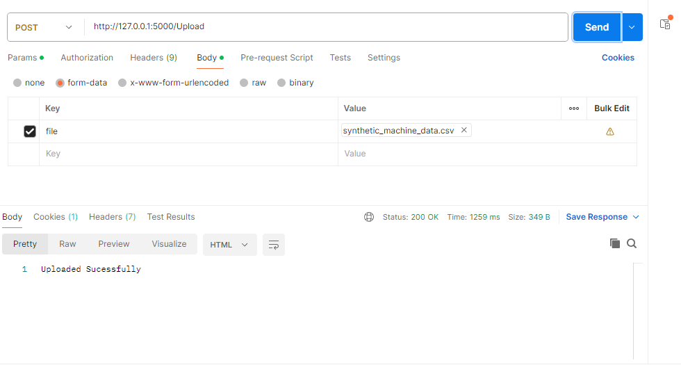
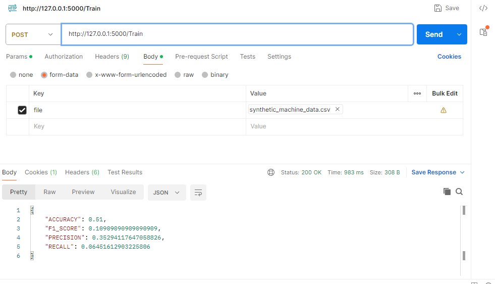
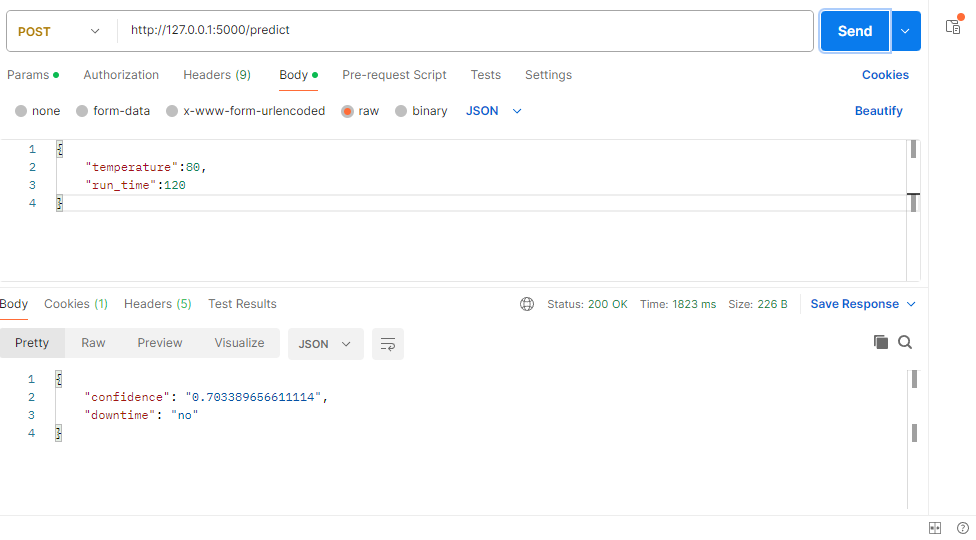

# TechSpree Task

### Clone the repository


```bash
  git clone https://github.com/Vaibhavsun/TechSpree-Task.git
```
```bash
  cd TechSpree-Task
```

### creating Virtual environment

```bash
  python -m venv env
```

### installing Requirements

```bash
  pip install -r Requirements.txt
```

### Run Flask on local server

```bash
  python main.py
```

## Examples
on postman API
1. /Upload

http://127.0.0.1:5000/Upload


2. /Train

http://127.0.0.1:5000/Train

3./predict


http://127.0.0.1:5000/predict


